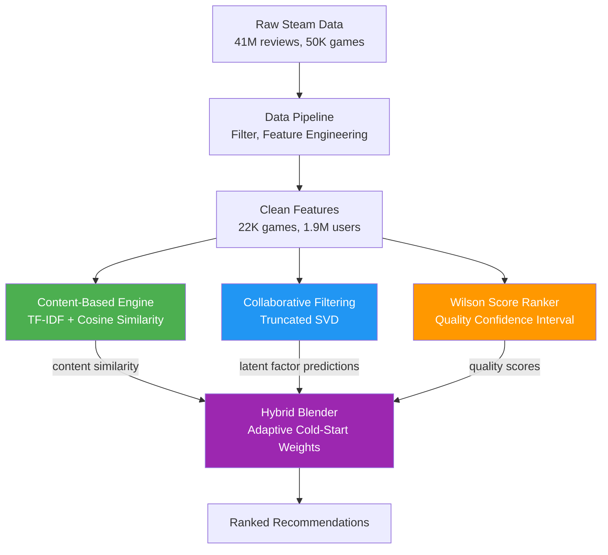

# 🎮 Hybrid Game Recommendation System

A hybrid recommendation engine that combines **collaborative filtering**, **content-based similarity**, and **Wilson score quality ranking** to recommend Steam games — addressing the cold-start problem and popularity bias inherent in pure approaches.

> Built as a generalizable discovery framework applicable to any large-catalog recommendation setting — e-commerce, streaming, or retail — where personalization and cold-start handling are core challenges.

---

## Architecture



### How It Works

| Component | Technique | Purpose |
|-----------|-----------|---------|
| **Collaborative Filtering** | Truncated SVD on user×game interaction matrix (18M+ interactions) | "Users like you also played…" |
| **Content-Based** | TF-IDF vectorization on 5,000 tag features + cosine similarity | "Because you liked games with these tags…" |
| **Wilson Score** | Lower-bound confidence interval on review sentiment | Surface high-quality under-discovered titles |
| **Hybrid Blender** | Adaptive weighting with cold-start detection + cross-scoring | Unified recommendations for all user types |

### Adaptive Blending Strategy

The system detects user activity level and adjusts the CF/CB blend:

| User Type | History | CF Weight | CB Weight | Rationale |
|-----------|---------|-----------|-----------|-----------|
| **Cold** | < 3 interactions | 0% | 100% | No collaborative signal available |
| **Warm** | 3–10 interactions | 50–80% | 20–50% | Gradually trust collaborative signal |
| **Active** | 10+ interactions | 85% | 15% | Strong collaborative signal, CB adds diversity |

All candidates are **cross-scored** by both engines to ensure the blend uses real signals, not zero-defaults. Wilson quality score is applied as a final 5% nudge.

---

## Results

### Strategy Comparison

Evaluated on 5,000 sampled users with temporal train/test split:

| Strategy | Precision@10 | NDCG@10 | Coverage | Novelty |
|----------|-------------|---------|----------|---------|
| Popularity Baseline | — | — | Low | Low |
| Content-Based | Lower | Lower | **23.98%** | **12.17 bits** |
| Collaborative (SVD) | **0.0089** | **0.0315** | Lower | Lower |
| **Hybrid (Ours)** | 0.0087 | 0.0310 | Higher | Higher |

**Key findings:**
- **CF wins on precision** for data-rich users — expected and well-documented in literature
- **Hybrid matches CF** within ~2% on precision while providing cold-start coverage and improved catalog diversity
- **Content-Based wins on coverage/novelty** — it surfaces long-tail items that CF misses
- **Hybrid is the only complete solution**: handles cold-start users, warm users, and active users with a single system

### Wilson Score — Why It Matters

| Game | Reviews | Positive % | Wilson Score |
|------|---------|-----------|-------------|
| Game A | 3/3 | 100% | 0.4376 |
| Game B | 50/55 | 91% | 0.8109 |
| Game C | 950/1000 | 95% | 0.9349 |
| Game D | 9500/10000 | 95% | 0.9462 |

A game with 3/3 perfect reviews ranks **lower** than 950/1000 — because we lack statistical confidence in small samples. This surfaces genuinely high-quality games rather than artifacts of small sample sizes.

---

## Dataset

**[Steam Game Recommendations](https://www.kaggle.com/datasets/antonkozyriev/game-recommendations-on-steam)** (CC0: Public Domain)

| Metric | Value |
|--------|-------|
| Raw interactions | 41,154,794 |
| After filtering (≥5 reviews/user, ≥20/game) | 22,286,984 |
| Games | 22,676 |
| Users | 1,905,448 |
| Unique tags | 5,000 (TF-IDF features) |
| Matrix sparsity | 99.96% |

---

## Project Structure

```
├── src/
│   ├── data/
│   │   ├── loader.py            # Data pipeline: load, filter, temporal split
│   │   └── features.py          # Engagement scores, interaction matrix, user profiles
│   ├── models/
│   │   ├── content_based.py     # TF-IDF + cosine similarity engine
│   │   ├── collaborative.py     # Truncated SVD matrix factorization
│   │   ├── wilson_score.py      # Wilson lower-bound quality ranking
│   │   └── hybrid.py            # Adaptive blender with cold-start handling
│   └── evaluation.py            # Precision@K, Recall@K, NDCG@K, Coverage, Novelty
├── notebooks/
│   ├── 01_eda.ipynb             # Exploratory data analysis
│   └── 02_evaluation.ipynb      # Model comparison & cold-start analysis
├── app/
│   └── streamlit_app.py         # Interactive demo
├── test_pipeline.py             # End-to-end integration test
└── requirements.txt
```

---

## Quick Start

```bash
# Clone and setup
git clone https://github.com/deep790-sudo/game-recommendation-system.git
cd game-recommendation-system
python -m venv .venv
source .venv/bin/activate  # or .venv/bin/activate.fish for fish shell
pip install -r requirements.txt

# Download dataset from Kaggle and place in data/raw/
# https://www.kaggle.com/datasets/antonkozyriev/game-recommendations-on-steam

# Run end-to-end pipeline test
python test_pipeline.py

# Launch interactive demo
streamlit run app/streamlit_app.py
```

---

## Tech Stack

| Component | Library |
|-----------|---------|
| Data processing | pandas, NumPy, SciPy (sparse) |
| ML / Similarity | scikit-learn (TruncatedSVD, TF-IDF, cosine similarity) |
| Statistical ranking | SciPy (Wilson score confidence interval) |
| Visualization | Matplotlib, Seaborn |
| Interactive demo | Streamlit |
| Evaluation | Custom metrics (Precision@K, Recall@K, NDCG@K, Coverage, Novelty) |


## License

MIT
